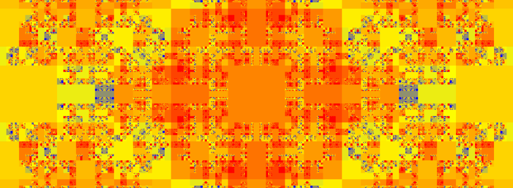

# faze

[](https://codeclimate.com/github/b-faze/faze/maintainability)
[](https://coveralls.io/github/b-faze/faze)




---

| Package           | NuGet | Build
|-------------------|-------|-------|
| Faze.Abstractions | [](https://www.nuget.org/packages/Faze.Abstractions/) | [](https://github.com/b-faze/faze/actions/workflows/Faze.Abstractions.yml) |
| Faze.Core         | [](https://www.nuget.org/packages/Faze.Core/) | [](https://github.com/b-faze/faze/actions/workflows/Faze.Core.yml) |
| Faze.Core.IO         | [](https://www.nuget.org/packages/Faze.Core.IO/) | [](https://github.com/b-faze/faze/actions/workflows/Faze.Core.IO.yml) |
| Faze.Engine       | [](https://www.nuget.org/packages/Faze.Engine/) | [](https://github.com/b-faze/faze/actions/workflows/Faze.Engine.yml) |
| Faze.Rendering    | [](https://www.nuget.org/packages/Faze.Rendering/) | [](https://github.com/b-faze/faze/actions/workflows/Faze.Rendering.yml) |

## About

faze is a collection of NuGet packages, providing tools and pipelines for visualising game logic as images. For more information please check out the gitbook at https://b-hub.gitbook.io/faze/ for documentation, examples and blogs.

## Gallery

[](https://github.com/b-faze/faze/actions/workflows/gallery.yml)

See an example gallery online at https://b-faze.github.io/faze/

Everything in the gallery is produced from this repository in Faze.Examples.Gallery.CLI, try it for yourself! The Gallery CLI splits the visualisation pipelines in half allowing data to be pre-computed (`generate-data`) to help speed up rendering (`generate-images`)

```
 Usages:
   generate-data [options]
   generate-images [options]
   check-images [pptions]
   
 generate-data options:
   --id         Generates data for a given id  [string]
  
 generate-images options:
   --album      Generates images for a given album  [string]
  
 check-images options:
   
```

## Quick Start

Create a new .NET Core 3.1 (or any platform supporting .NET Standard 2.0) console application and install the Faze.Rendering NuGet package.

```
nuget install Faze.Rendering
```

Change your Main method to the following:

```
 static void Main(string[] args)
 {
     var size = 3;
     var maxDepth = 4;

     var rendererOptions = new SquareTreeRendererOptions(size, 500)
     {
         BorderProportion = 0.1f
     };

     IPipeline pipeline = ReversePipelineBuilder.Create()
         .File("my_first_visualisation.png")
         .Render(new SquareTreeRenderer(rendererOptions))
         .Paint<object>(new CheckeredTreePainter())
         .LoadTree(new DynamicSquareTreeOptions<object>(size, maxDepth, info => null), new DynamicTreeDataProvider<object>());

     pipeline.Run();
 }
```
Run your console application and see your first visualisation! Have a look in your bin folder for 'my_first_visualisation.png', otherwise give it a custom filepath e.g. @"C:\path\of\your\choice\my_first_visualisation.png".


For creating your own trees and visualisations see [gitbooks documentation](https://b-hub.gitbook.io/faze/) or clone this repository and see the gallery examples.
