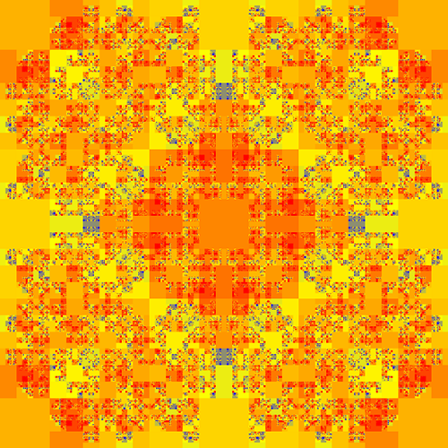

# Introduction

Much like how the famous [Mandelbrot set](https://en.wikipedia.org/wiki/Mandelbrot_set) beautifully represents the complexity born out of a simple set of rules. Faze aims to create similar images from the rules of games, where zooming into the image is equivalent to exploring a sequence of moves in the game.

Fractals by nature are recursive and so is the way computers explore games to find optimal solutions! Using fractals, I wanted to create a way to illustrate how a computer may 'see' a game, to highlight moves it thinks are better than others. Depending on how you approach this, the images produced can not only be a representation of what a computer sees, but also a visualisation of the game itself.

This documentation is currently a work in progress, but I have written some blog posts explaining the concept:





