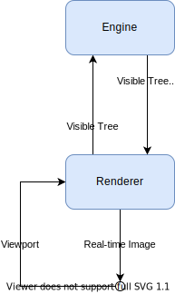

# Real-time Rendering

Rendering games with large decision trees will mean the possibility of zooming into the image, exploring all the possible ways to play it. However, there will be too much information to simply create a high enough resolution image. If you wanted to print a single high-res image of noughts and crosses, rendering the whole of the game tree, you would need an area of ~$$1.66m^2$$ or ~$$65in^2$$ \( $$= 3^9pixels * 300pixels/in$$ \)

Instead, we can filter the game tree by keeping track of only the parts that are being displayed within the viewport, collecting only the data for possible games within that sub-tree.

