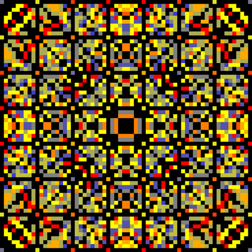
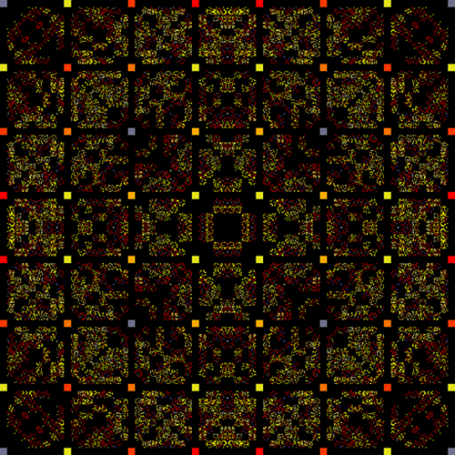

# 8 Queens Problem

> The [**eight queens puzzle**](https://en.wikipedia.org/wiki/Eight_queens_puzzle) is the problem of placing eight [chess](https://en.wikipedia.org/wiki/Chess) [queens](https://en.wikipedia.org/wiki/Queen_%28chess%29) on an 8×8 [chessboard](https://en.wikipedia.org/wiki/Chessboard) so that no two queens threaten each other; thus, a solution requires that no two queens share the same row, column, or diagonal.

