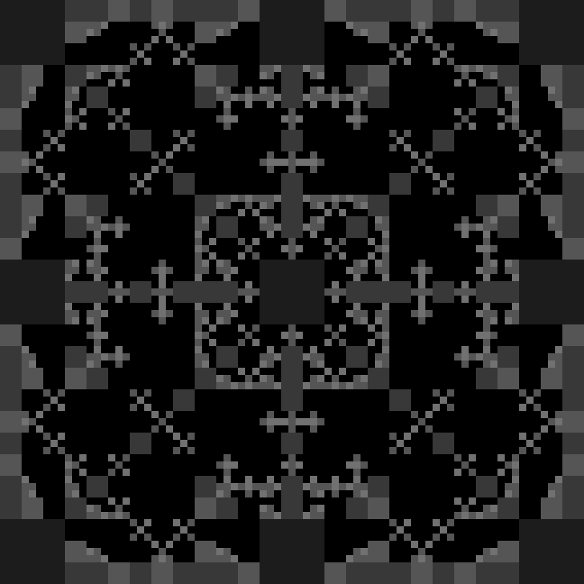
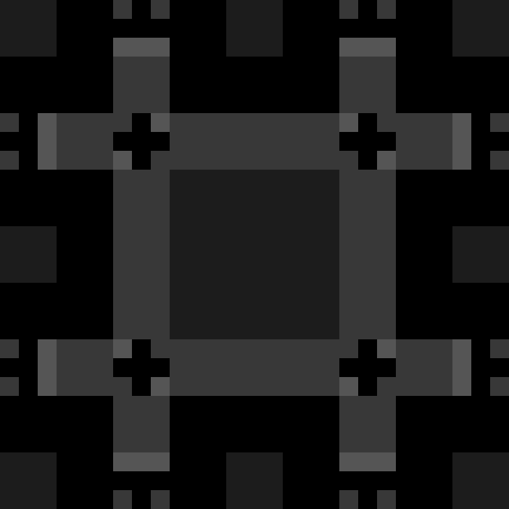

# Chess Pieces

Similar to the [8 Queens Problem](8-queens-problem.md), the following images show the ways in which single chess pieces can be placed on increasing board sizes, such that each piece is not being attacked by another.

### Pawn

   

### Knight

  

### Bishop

  

### Rook

  

### Queen

  

### King

  

