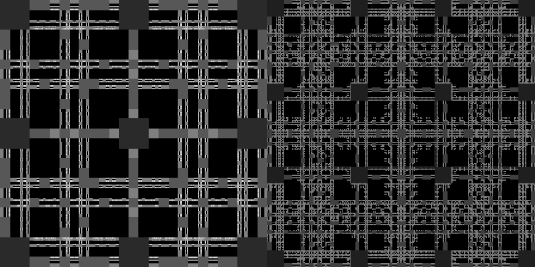
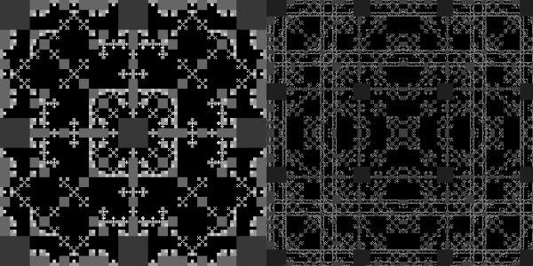
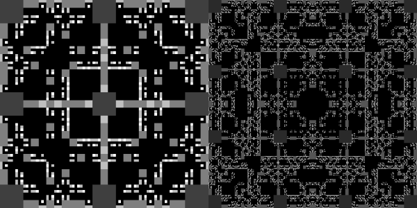
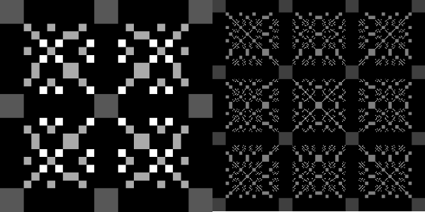
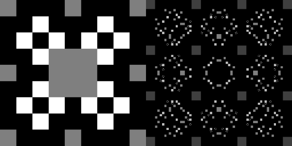
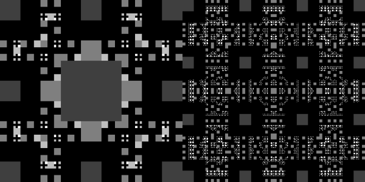

# Chess Pieces

A generalisation to the [8 Queens Problem](8-queens-problem.md), the following images show the ways in which single chess pieces can be placed on increasing board sizes, such that each piece is not being attacked by another. However, unlike the 8 Queens Problem which has a solution, the following images are only coloured by the depth \(number of moves\), rather than the number of solutions.

## Examples

The following images show the different ways each piece can be placed on a 3x3 and 4x4 board. You can see them and other variations in the [gallery](https://b-faze.github.io/faze/Piece-Board.html).

### Pawn



### Knight



### Bishop



### Rook



### Queen



### King



## Pipeline Summary

```csharp
ReversePipelineBuilder.Create()
    .GallerySave(galleryService, galleryMetaData)
    .Render(new SquareTreeRenderer(rendererConfig))
    .Paint(new PiecesBoardPainter())
    .GameTree(new SquareTreeAdapter(boardSize))
    .Build();
```

### Tree Painter

The tree painter used is the type `PiecesBoardPainter`  which converts the game tree into a colour tree using the following code:

```csharp
    public Tree<Color> Paint(Tree<IGameState<GridMove, SingleScoreResult?>> tree)
    {
        var resultTree = tree.MapValue((x, info) =>
        {
            var result = x.GetResult();
            if (result != null)
                return Math.Max(result.Value, 0);

            return info.Depth;
        });

        var maxValue = resultTree
            .GetLeaves()
            .Max(t => t.Value);

        var colorTree = resultTree
            .MapValue(x => (double)x / maxValue)
            .MapValue(colorInterpolator);

        return colorTree;
    }
```

First the game tree is converted into a `resultTree`. Each node in the tree is either represented by the game's result or, if there are still available moves, the current depth. The result returned by the `PiecesBoardState` is a score equal to the number of pieces successfully placed or -1 if placing a piece resulted in an attack.

The result is then turned into a colour by normalising the score against the best possible one and then using a `colorInterpolator` \(default for `PiecesBoardPainter` is `GreyscaleInterpolator`\)

