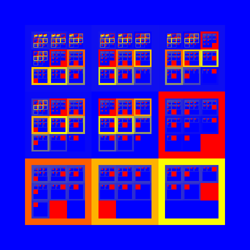

# Getting Started

## Quick Start

Create a new .NET Core 3.1 \(or any platform supporting .NET Standard 2.0\) console application and install the Faze.Rendering NuGet package.

```text
nuget install Faze.Rendering
```

Change your Main method to the following:

```text
 static void Main(string[] args)
 {
     var size = 3;
     var maxDepth = 4;

     var rendererOptions = new SquareTreeRendererOptions(size, 500)
     {
         BorderProportion = 0.1f
     };

     IPipeline pipeline = ReversePipelineBuilder.Create()
         .File("my_first_visualisation.png")
         .Render(new SquareTreeRenderer(rendererOptions))
         .Paint<object>(new CheckeredTreePainter())
         .LoadTree(new DynamicSquareTreeOptions<object>(size, maxDepth, info => null), new DynamicTreeDataProvider<object>());

     pipeline.Run();
 }
```

### Result

Run your console application and see your first visualisation! Have a look in your bin folder for 'my\_first\_visualisation.png', otherwise give it a custom filepath e.g. @"C:\path\of\your\choice\my\_first\_visualisation.png".


## Custom Visualisation V2

In the previous [Quick Start](getting-started.md#quick-start) section you saw how to render a tree using the pipeline. In this section we will extend the previous example by creating our own game tree.

Change your Main method to the following:

```csharp
static void Main(string[] args)
{
    var size = 3;
    var maxDepth = 4;

    var rendererOptions = new SquareTreeRendererOptions(size, 500)
    {
        BorderProportion = 0.1f,
        MaxDepth = 4
    };

    IPipeline pipeline = ReversePipelineBuilder.Create()
        .File("my_first_visualisation.png")
        .Render(new SquareTreeRenderer(rendererOptions))
        .Paint(new GoldInterpolator())
        .Map<double, WinLoseDrawResultAggregate>(t => t.MapValue(agg => agg.GetWinsOverLoses()))
        .Map(new MyCustomGameResultsMapper())
        .GameTree()
        .Build(() => MyCustomGame.Initial(15));

    pipeline.Run();
}
```

The pipeline has been changed to use a different tree painter `GoldInterpolator`, some `Map` steps and the tree loading has been replaced with a new game `MyCustomGame`.

The `GoldInterpolator` requires a `Tree<double>` between 0 and 1.

The `Map` methods map the tree between the required double and an `IGameState<GridMove, WinLoseDrawResult?>`

The game tree then comes from an instance of the `MyCustomGame`. 

### MyCustomGame

Defines the rules of a game and is used to create a game tree to eventually be mapped to a `Tree<double>`

The following code defines a single player game which maps to the same space as our `DynamicSquareTree` of size 3. Each move consists of selecting a number between 1 and 10 \(mapped to 0 - 9 for the GridMove\). The game is won by selecting numbers that sum up to the provided target and lost if the sum is greater than the target.

```csharp
public class MyCustomGame : IGameState<GridMove, WinLoseDrawResult?>
{
    private int target;
    private int currentValue;

    public static MyCustomGame Initial(int target)
    {
        return new MyCustomGame(target, 0);
    }

    private MyCustomGame(int target, int currentValue)
    {
        this.target = target;
        this.currentValue = currentValue;
    }

    public PlayerIndex CurrentPlayerIndex => PlayerIndex.P1;

    public IEnumerable<GridMove> GetAvailableMoves()
    {
        if (GetResult() != null)
        {
            return new GridMove[0];
        }

        return Enumerable.Range(0, 9).Select(i => new GridMove(i));
    }

    public WinLoseDrawResult? GetResult()
    {
        if (currentValue < target)
            return null; // game is not over

        if (currentValue == target)
            return WinLoseDrawResult.Win;

        return WinLoseDrawResult.Lose;
    }

    public IGameState<GridMove, WinLoseDrawResult?> Move(GridMove move)
    {
        var moveValue = move + 1; // move is zero-indexed
        return new MyCustomGame(target, currentValue + moveValue);
    }
}
```

### MyCustomGameResultsMapper

This class is responsible for transforming the game's state tree into a results tree. In this example we aggregate all the win and lose results into a `WinLoseDrawResultAggregate`

```csharp
public class MyCustomGameResultsMapper : ITreeMapper<IGameState<GridMove, WinLoseDrawResult?>, WinLoseDrawResultAggregate>
{
    public Tree<WinLoseDrawResultAggregate> Map(Tree<IGameState<GridMove, WinLoseDrawResult?>> tree, IProgressTracker progress)
    {
        return tree
            .MapValue(state => state.GetResult())
            .MapValueAgg(result =>
            {
                return result.HasValue
                    ? new WinLoseDrawResultAggregate(result.Value)
                    : new WinLoseDrawResultAggregate();
            }, () => new WinLoseDrawResultAggregate());
    }
}
```

### Result

From our game of arbitrary rules you can see that there are more ways to lose the game than to win. Also games are won a lot earlier when choosing moves of 6 or more.


## Custom Visualisation V3

Modify the Main method again to look like:

```csharp
static void Main(string[] args)
{
    var size = 3;
    var maxDepth = 4;

    var rendererOptions = new SquareTreeRendererOptions(size, 500)
    {
        BorderProportion = 0.1f,
        MaxDepth = 4
    };

    IPipeline pipeline = ReversePipelineBuilder.Create()
        .File("my_first_visualisation.png")
        .Render(new SquareTreeRenderer(rendererOptions))
        .Paint(new GoldInterpolator())
        .Map(new MyCustomGameResultsMapper())
        .GameTree()
        .Build(() => MyCustomGame.Initial(15));

    pipeline.Run();
}
```

### MyCustomGameResultsMapper

Modify the MyCustomGameResultsMapper class to the following:

```csharp
public Tree<double> Map(Tree<IGameState<GridMove, WinLoseDrawResult?>> tree, IProgressTracker progress)
{
    return tree
        .MapValue(state => state.GetResult())
        .MapTree(GetScore)
        .NormaliseSiblings();
}

private double GetScore(Tree<WinLoseDrawResult?> tree, TreeMapInfo info)
{
    if (tree == null)
        return 0;

    if (tree.IsLeaf())
    {
        var result = tree.Value;
        double score = result == WinLoseDrawResult.Win ? 100 : 0;
        return score / (info.Depth + 1);
    }

    var childCount = tree.Children.Count();
    var childSum = tree.Children.Select((child, index) => GetScore(child, info.Child(index))).Sum();

    return childSum / childCount;
}
```

With this modification we are performing all tree mapping steps within the class. This time we score the game based on the result and how many moves were needed to win. Winning the game in the fewest moves will give a better score. The score is also normalised against its siblings at each depth, so the image will represent the best choice at each given point in the game.

### Result



## Next Steps

Now it is time for you to experiment yourself! Have a look at the rest of the documentation or have a look at the example section.

