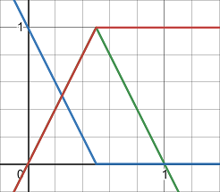
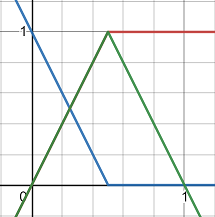

# Color Interpolators

## Linear

The `LinearColorInterpolator` is a generalised linear interpolator where you specify the two colours to interpolate between.


### Options

| Property | Type | Description |
| :--- | :--- | :--- |
| Start | Color | Color if value is 0 |
| End | Color | Color if value is 1 |

## Greyscale

The `GreyscaleColorInterpolator` is a common linear interpolator from Black -&gt; While


```csharp
public class GreyscaleInterpolator : LinearColorInterpolator, IColorInterpolator
```

### Options

| Property | Type | Description |
| :--- | :--- | :--- |
| Reverse | bool | If true, starts from white instead of black |

## Gold

A custom interpolator which emphasises the mid-range, going from Blue -&gt; Yellow -&gt; Red


<table>
  <thead>
    <tr>
      <th style="text-align:left">Channel</th>
      <th style="text-align:left">Formula</th>
      <th style="text-align:left">Graph</th>
    </tr>
  </thead>
  <tbody>
    <tr>
      <td style="text-align:left">Red</td>
      <td style="text-align:left"></td>
      <td style="text-align:left">
        <p></p>
        <p>
          
        </p>
      </td>
    </tr>
    <tr>
      <td style="text-align:left">Green</td>
      <td style="text-align:left"></td>
      <td style="text-align:left">
        
      </td>
    </tr>
    <tr>
      <td style="text-align:left">Blue</td>
      <td style="text-align:left"></td>
      <td style="text-align:left">
        
      </td>
    </tr>
  </tbody>
</table>

### Options

_None_

