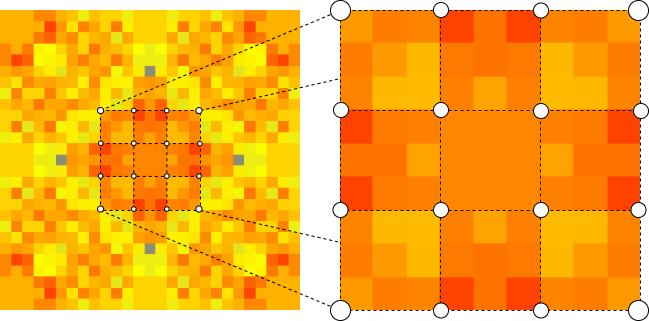
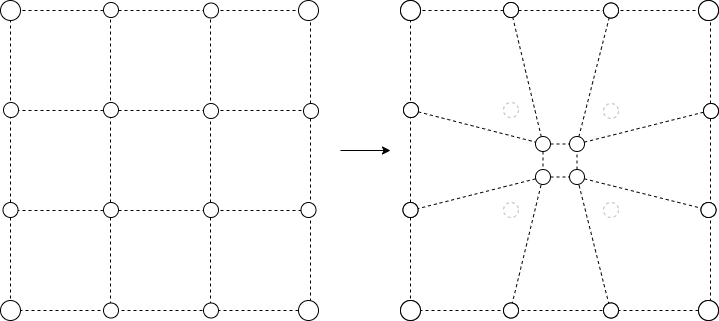
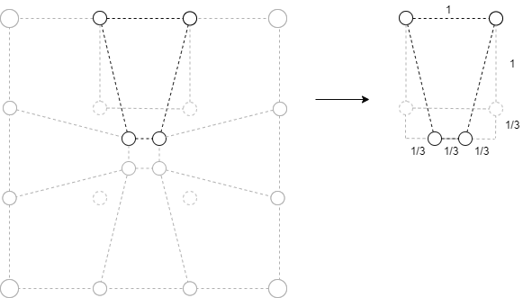
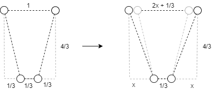
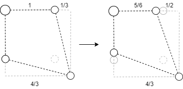

# Compressed Square Tree Renderer

For games with a small branching factor and a decreasing move set, large regions of the image will only represent the first couple of moves. It would be nice to scale back the initial moves and enlarge the subsequent moves so that all moves have an equal size but the hierarchical structure remains.

Taking Noughts and Crosses as an example, as you cannot make a move in the middle more than once, it will always show as a large square, compared to subsequent moves. It may be worth trying to compensate for this by scaling the middle square to be equal to all the other moves.

In this example the middle tile is taking up $$\frac{1}{9}$$ the available space. If we were scale down the middle tile, while scaling up all other tiles we could increase the overall resolution at the cost of warping the space. We would also need to consider how to adjust the shape of the surrounding tiles to make sure all tiles get an equal share.

### How much wasted space is there?

The optimal size of a tile, such that all tiles have the same area is 81/73/81 = 1.37%. That means the current small tiles would take up 72 \* 1.37% = 98.63%. That is an increase from 72/81 = 88.89% of 9.74%.

This means there is about 9.74% wasted space caused by the larger squares. 

### Adjusting surrounding tiles

#### The center tile

If the center tile is reduced in size by $$\frac{1}{3}$$ then resulting size of the orthogonal tiles will be:

$$1(1 + \frac{1}{3}) - 2(\frac{1}{2})(\frac{4}{3})(\frac{1}{3}) = \frac{4}{3} - \frac{4}{9} = \frac{8}{9}$$ 

The tiles will be warped such that the area decreases by $$\frac{1}{9}$$. Instead the resultant area should be $$\frac{10}{9}$$.

$$\frac{4}{3}(2x + \frac{1}{3}) - \frac{4}{3}x = \frac{10}{9}$$ 

$$2x + \frac{1}{3} - x = \frac{10}{12}$$ 

$$x = \frac{1}{2}$$ 

... and to doublecheck the effects on the corner tiles, lets calculate the new area.

$$(\frac{4}{3})^2 - (\frac{1}{2})(\frac{4}{3}) = \frac{10}{9}$$ 

#### The side tiles

To do

#### The corner tiles

To do

#### Generalising for any square tree

To do

### Adjusting inner tiles

To do

