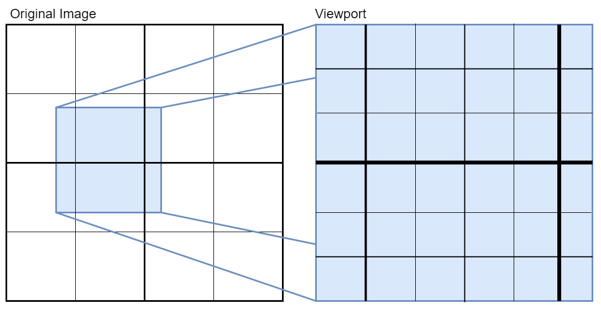

# Square Tree Renderer

This renderer is responsible for being able to infinitely subdivide a space into equal squares to represent a tree structure. Each square or 'tile' can be mapped back to a set of nodes in the tree. Each pixel in the image can then be coloured according to the set of nodes it belongs to. The branching factor of the tree must be a square number.


The renderer must be able to handle zooming and translating an arbitrary amount while maintaining an accurate representation of the tree within the viewport.



It is not known at present, but ideally the renderer must allow for infinite zooming without loss of precision. It is an objective of this research to know whether it is possible or not.

## Space -&gt; Tree mapping

### Definition

Given a point $$P$$ in space, find which tree nodes it represents.


In this example $$P = (0.68, 0.28)$$ and when we divide the space by 2 and 3 we see tiles \(1,0\) and \(2,0\) overlap with the point respectively.

So, is there a formula / algorithm that exists that can give us the coordinate of the tile given a point.

### Finding the tile coordinate


The above diagram illustrates what happens when we scale our space by the lacunarity. We can now clearly see how we can get our tile coordinate, by multiplying our point by the lacunarity and then flooring the result.

> $$T={\lfloor}LP{\rfloor}$$

Where $$T$$ is the tile coordinate, $$L$$ is the lacunarity and $$P$$ our original point.

E.g.

> $$T={\lfloor}LP{\rfloor}={\lfloor}2(0.68,0.28){\rfloor}={\lfloor}(1.36,0.56){\rfloor}=(1,0)$$

> $$T={\lfloor}LP{\rfloor}={\lfloor}3(0.68,0.28){\rfloor}={\lfloor}(2.04,0.84){\rfloor}=(2,0)$$

### Finding sub-tiles

So what if we kept going? We have found the first tile, but if we subdivide it again what is the next?


Looking back at our tile coordinate diagram, this step is simple too!


If instead of flooring the point we take the remainder. This then gives us the point relative to the first tile!


> $$T_n={\lfloor}LP_n{\rfloor}$$

> $$P_{n+1}=Frac(LP_{n})$$

The following \(JavaScript-esk\) pseudocode returns an infinite list of tile points represented by the point P.

```text
function* getTilePoints (P, L) {
  PL = P*L;
  yield Floor(PL);

  P' = Fract(PL);
  foreach (p in getTilePoints(P', L)) 
    yield p;
}
```

E.g. for input P=\(0.68,0.28\) and L=3 getTilePoints will return:

> \(2,0\)

> \(0,2\)

> \(0,1\)

> \(1,1\)

> ...

## Viewport Scale and Translation

So far we can find all tree nodes that are represented with a point. This point has always been relative to a specific tile.  


